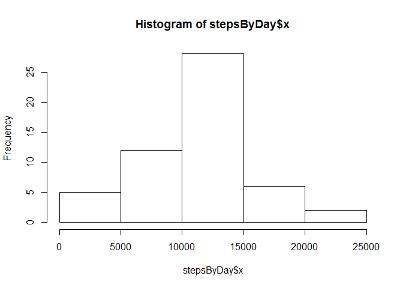

# Reproducible Research: Peer Assessment 1


## Loading and preprocessing the data

```r
data = read.csv('activity.csv')
summary(data)
```

```
##      steps                date          interval     
##  Min.   :  0.00   2012-10-01:  288   Min.   :   0.0  
##  1st Qu.:  0.00   2012-10-02:  288   1st Qu.: 588.8  
##  Median :  0.00   2012-10-03:  288   Median :1177.5  
##  Mean   : 37.38   2012-10-04:  288   Mean   :1177.5  
##  3rd Qu.: 12.00   2012-10-05:  288   3rd Qu.:1766.2  
##  Max.   :806.00   2012-10-06:  288   Max.   :2355.0  
##  NA's   :2304     (Other)   :15840
```

## What is mean total number of steps taken per day?

```r
stepsByDay <-  aggregate(data$steps, by=list(data$date),FUN=sum)
hist(stepsByDay$x)
```

 

```r
mean(na.omit(stepsByDay$x))
```

```
## [1] 10766.19
```

```r
median(na.omit(stepsByDay$x))
```

```
## [1] 10765
```


## What is the average daily activity pattern?


## Imputing missing values


## Are there differences in activity patterns between weekdays and weekends?
