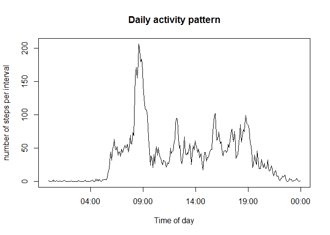
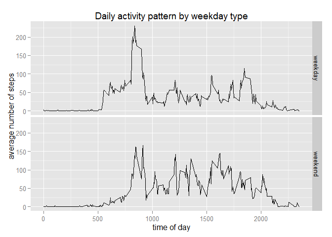

# Reproducible Research: Peer Assessment 1


## Loading and preprocessing the data

```r
data = read.csv('activity.csv')
summary(data)
```

```
##      steps                date          interval     
##  Min.   :  0.00   2012-10-01:  288   Min.   :   0.0  
##  1st Qu.:  0.00   2012-10-02:  288   1st Qu.: 588.8  
##  Median :  0.00   2012-10-03:  288   Median :1177.5  
##  Mean   : 37.38   2012-10-04:  288   Mean   :1177.5  
##  3rd Qu.: 12.00   2012-10-05:  288   3rd Qu.:1766.2  
##  Max.   :806.00   2012-10-06:  288   Max.   :2355.0  
##  NA's   :2304     (Other)   :15840
```

## What is mean total number of steps taken per day?

```r
stepsByDay <-  aggregate(data$steps, by=list(data$date),FUN=sum,na.rm=TRUE)
hist(stepsByDay$x)
```

 

```r
mean(stepsByDay$x)
```

```
## [1] 9354.23
```

```r
median(stepsByDay$x)
```

```
## [1] 10395
```


## What is the average daily activity pattern?

```r
stepsByInterval <-  aggregate(data$steps, by=list(data$interval),FUN=mean,na.rm=TRUE)
times<-strptime(formatC(stepsByInterval$Group.1,width=4,format="d", flag="0"),'%H%M')
plot(times,stepsByInterval$x, type='l')
```

 

```r
maxTime <- subset(stepsByInterval, stepsByInterval$x==max(stepsByInterval$x))
format(strptime(formatC(maxTime$Group.1,width=4,format="d", flag="0"),'%H%M'),'%H:%M')
```

```
## [1] "08:35"
```
## Imputing missing values

```r
getMean <- function(tst) {
  tst2=tst[3]
  if (!is.nan(as.numeric(tst2))) 
    tst[1] <- (stepsByInterval$x[as.numeric(tst2)==stepsByInterval$Group.1]);
}
imputed<-data
imputedValues<- apply(imputed,1,function(x) getMean(x))
imputed$imputedSteps <- imputedValues
imputed <- transform(imputed,steps=ifelse(is.na(steps),imputedSteps,steps))

stepsByDayImputed <-  aggregate(imputed$steps, by=list(imputed$date),FUN=sum,na.rm=TRUE)
hist(stepsByDayImputed$x)
```

 

```r
mean(stepsByDayImputed$x)
```

```
## [1] 10766.19
```

```r
median(stepsByDayImputed$x)
```

```
## [1] 10766.19
```

## Are there differences in activity patterns between weekdays and weekends?

```r
imputed$weekend <- chron::is.weekend(imputed$date)
groupSteps <- aggregate(imputed$steps, by =list(interval=imputed$interval,weekend=imputed$weekend),FUN=mean)
library(ggplot2)
```

```
## Warning: package 'ggplot2' was built under R version 3.1.3
```

```r
g <- ggplot(groupSteps, aes(interval, x))
g + geom_line() + facet_grid(weekend ~ .)
```

 
